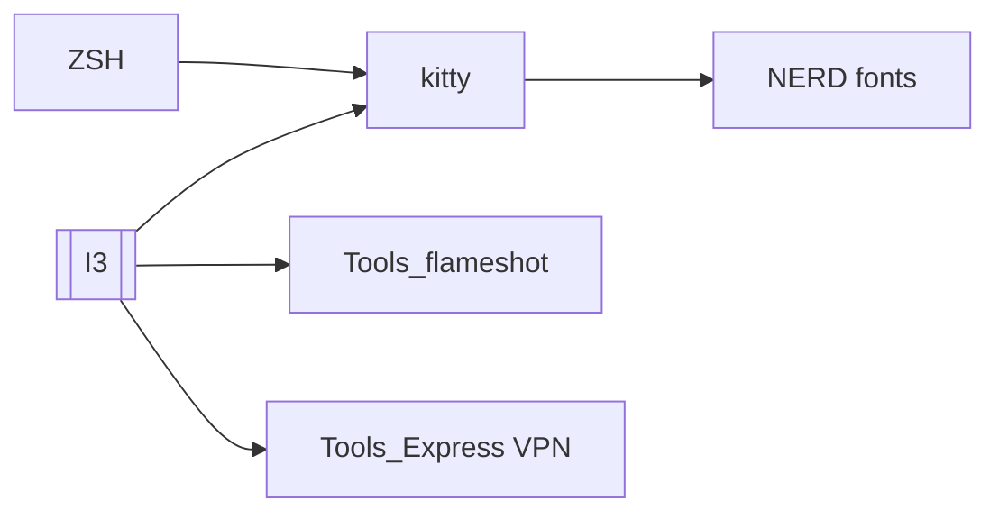

# Back up and restore 

## Crytical tools settings

- [ ] `~/.bashrc` 
- [ ] **I3**
- [ ] Kitty
   - [ ] `~/.config/kitty/kitty.conf`
   - [ ] NERD fonts (
       - JetBrains Mono 
       - Iosevka (retro enough **with** ligatures)
       - Monoid (retro enough **with** ligatures)
       - GoHuFont (retro **no** ligatures)
       )
- [ ] ZSH
- [ ] TMUX 
- [ ] NVIM
- [ ] T Tools

## Dependencies

## TLP

There are mutliple diffrent files that needs to be stored and sometimes copied and modified 

`/etc/tlp.conf` - Energy configuration

`sudo systemctl restart tlp`

`tlp-stat -u`
